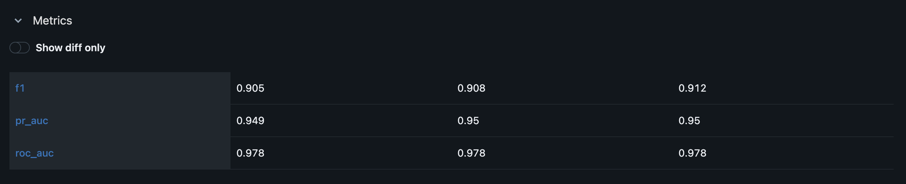
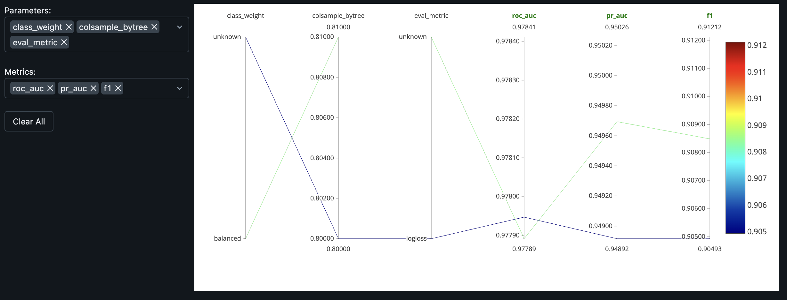

# Sentinel-PdM

Predictive maintenance for industrial induction hardening machines, deployed end-to-end.
Physics-based simulator → 1 Hz ML scoring → live operator dashboard.

**Live demo:** https://sentinel-simulator-69435327302.asia-northeast1.run.app/

---

## Live demo

| | URL |
|---|---|
| **Dashboard** | https://sentinel-simulator-69435327302.asia-northeast1.run.app/ |
| **AI engine API** | https://sentinel-ai-engine-69435327302.asia-northeast1.run.app/ |

Open the dashboard, click **Fresh start**, then use the **Simulate failure** dropdown (bottom-right) to inject a degradation. The AI risk gauge moves within ~60 seconds and the alert log escalates `OK → WARNING → CRITICAL → HALTED`. Click **Repair** to recover.

> **Heads-up:** Supabase free tier auto-pauses the database after 7 days of inactivity. If the first visit feels slow or shows empty data, the DB is waking up — give it ~30 seconds.

---

## What it does

Two services share one Postgres database. The simulator generates realistic 8-channel sensor telemetry (induction power, coil voltage, quench temp/flow/pressure, part temp, scan speed, vibration) at 1 Hz and writes it to Postgres along with ground-truth failure labels. The AI engine reads those rows, computes rolling-window features, runs an XGBoost + Random Forest ensemble + Isolation Forest, and writes risk and anomaly scores back. The React dashboard reads the same rows the AI engine writes — no HTTP between services; **the database is the bus**.

Three failure modes are modelled, each with a distinct sensor signature:

| Mode | Onset | What the sensors do |
|---|---|---|
| `coolant_pump` | 30–60 min (gradual) | quench flow trends down, quench temp rises, part temp gets noisy |
| `quench_system` | 5–15 min (semi-abrupt) | quench pressure drops sharply, flow follows, part temp rises post-quench |
| `power_supply` | 20–40 min (gradual) | induction power gets noisy and drifts down, scan speed fluctuates |

---

## Demo


> _TODO: 30-60 s GIF showing fresh start → coolant_pump failure injection → risk gauge climbing → HALTED state → repair. Place at `docs/demo.gif`; this README needs no edit when the file lands._

---

## Architecture

```
┌─────────────────────────────────────┐     ┌──────────────────────────────────────┐
│        machine-simulator            │     │          pdm-ai-engine               │
│                                     │     │                                      │
│  Physics engine (3 failure modes)   │     │  XGBoost + Random Forest classifier  │
│  ─ Coolant pump degradation         │     │  → ai_risk_score (0.0–1.0)           │
│  ─ Quench system failure            │     │                                      │
│  ─ Power supply drift               │     │  Isolation Forest anomaly detector   │
│                                     │     │  → ai_anomaly_score                  │
│  FastAPI (async) + SQLAlchemy       │     │                                      │
│  Writes: sensor columns + labels    │     │  Polls Postgres every 1s             │
│  Reads:  ai_risk_score (dashboard)  │     │  Writes: ai_* columns only           │
│                                     │     │                                      │
│  React + Vite operator dashboard    │     │  MLflow experiment tracking          │
└──────────────┬──────────────────────┘     └────────────────┬─────────────────────┘
               │                                             │
               └──────────────────┬──────────────────────────┘
                                  │
                        ┌─────────▼──────────┐
                        │  Postgres (shared)  │
                        │  telemetry table    │
                        │  sim_runs table     │
                        └─────────────────────┘
```

Strict ownership: simulator writes the sensor + label columns, AI engine writes only the `ai_*` columns. Schema is in [CLAUDE.md](CLAUDE.md) for the curious.

---

## Dashboard

Three role-tailored tabs, all feeding off the same Postgres rows:

- **Plant** — supervisor roll-up: cumulative yield vs shift target, NG Pareto, coil life remaining, incident timeline.
- **Operator** — line view: live parts/hour ticker, defect rate, OK/NG bars, current risk gauge, failure-injection + repair controls.
- **Maintenance** — engineer view: 8-channel sensor time-series, anomaly score, PSI drift, persistent alert escalation log, 3D machine visualisation.

---

## Model metrics

Trained on 100k+ rows of fast-gen simulator data with ~85/15 normal/failure class balance. Target: `will_fail_10min` (10-minute lookahead binary classifier).

| Model | ROC-AUC | PR-AUC | F1 (failure class) |
|---|---|---|---|
| XGBoost | 0.978 | 0.949 | 0.905 |
| Random Forest | 0.978 | 0.950 | 0.908 |
| **Ensemble (deployed)** | **0.978** | **0.950** | **0.912** |

False positive rate <1%, inference ~50 ms per row. Full metrics + confusion matrices: [pdm-ai-engine/models/model_performance_card_v1.md](pdm-ai-engine/models/model_performance_card_v1.md). Raw JSON: [pdm-ai-engine/models/classifier_metrics.json](pdm-ai-engine/models/classifier_metrics.json).

Every training run is tracked in MLflow (experiment name `sentinel-pdm`, local file backend at `pdm-ai-engine/mlruns/`):





---

## Tech stack

| Layer | Technology |
|---|---|
| Simulator backend | Python 3.11, FastAPI, SQLAlchemy async, asyncpg |
| Operator dashboard | React, Vite, Tailwind CSS, Recharts |
| ML engine | scikit-learn, XGBoost, MLflow |
| Database | PostgreSQL 15 (Supabase in prod, Docker locally) |
| Build & deploy | Google Cloud Build, Artifact Registry, Cloud Run (asia-northeast1) |

---

## Try the live demo

You can drive the deployed sim entirely from your terminal:

```bash
SIM=https://sentinel-simulator-69435327302.asia-northeast1.run.app
AI=https://sentinel-ai-engine-69435327302.asia-northeast1.run.app

# Wipe live state and start fresh
curl -X POST $SIM/simulation/reset
curl -X POST $SIM/simulation/start

# Inject a coolant pump failure that ramps over 5 minutes
curl -X POST "$SIM/simulation/inject-failure?mode=coolant_pump&onset_seconds=300"

# Watch the AI engine react
curl -s $AI/api/production | jq '{current_state, current_risk, current_status}'

# Operator repair (clears DOWN state, resets cycle)
curl -X POST $SIM/simulation/repair
```

`mode` accepts `coolant_pump`, `quench_system`, or `power_supply`. Full simulator API at `$SIM/docs`, AI engine at `$AI/docs`.

---

## Local development

**Prerequisites:** Docker, Python 3.11 (via pyenv), Node 18+.

```bash
# Easiest: one command boots Postgres + both services + dashboard
docker compose up --build
```

Or run services individually for hot-reload:

```bash
# 1. Boot Postgres
docker compose up postgres -d

# 2. Simulator backend
cd machine-simulator && source .venv/bin/activate
uvicorn backend.main:app --reload

# 3. AI engine
cd pdm-ai-engine && source .venv/bin/activate
uvicorn src.sentinel_pdm.services.api:app --port 8100 --reload

# 4. Frontend dev server (hot reload)
cd machine-simulator/frontend && npm install && npm run dev
```

Dashboard: http://localhost:5173 · Simulator API: http://localhost:8000/docs · AI engine API: http://localhost:8100/docs

**Generate training data (fast-gen, no sleep):**

```bash
curl -X POST "http://localhost:8000/simulation/generate-training-data?duration_hours=168&failure_probability=0.15"
```

168 sim-hours in 60–90 seconds of wall-clock. Output lands in the `telemetry` table with `sim_run_id >= 2`.

---

## Deployment

The production stack:

- **Build:** `gcloud builds submit` (Linux/AMD64 in the cloud, no local Docker) → image to Artifact Registry (`asia-northeast1`)
- **Serve:** Cloud Run, both services with `--min-instances=1`. AI engine gets `--no-cpu-throttling` so its background poll loop keeps running between HTTP requests
- **Database:** Postgres on Supabase via the pgBouncer pooler (port 6543); asyncpg configured with `statement_cache_size=0` to survive transaction-mode pooling
- **Frontend:** React/Vite bundle baked into the simulator container; FastAPI serves it with a SPA catch-all so deep links (`/dashboard?tab=plant`) survive page refresh
- **CORS:** AI engine `allow_origins` driven by `CORS_ALLOW_ORIGINS` env var, defaults include the production simulator URL

Every bug we hit during deployment and the fix is logged in [LOGBOOK.md](LOGBOOK.md) — see the Day 14 entries.

---

## Project structure

```
sentinel-pdm/
├── machine-simulator/        # Service 1: data factory + operator dashboard
│   ├── backend/              # FastAPI, SQLAlchemy models, simulation engine, alembic
│   ├── frontend/             # React + Vite dashboard
│   └── Dockerfile            # Multi-stage: Node build → FastAPI runtime
├── pdm-ai-engine/            # Service 2: ML prediction engine
│   ├── src/sentinel_pdm/     # Package: training, inference, pipeline, monitoring
│   ├── models/               # Trained joblib bundles + metrics
│   └── Dockerfile            # Multi-stage: pip install → slim runtime
├── docker-compose.yml        # Boots Postgres + both services
├── DECISIONS.md              # Locked architectural decisions
├── LOGBOOK.md                # Engineering incident log
└── README.md                 # You are here
```

---

## Cost & uptime notes

- Current deploy uses `--min-instances=1 --no-cpu-throttling` on both services. Inside the GCP $300 free trial (90 days) this is effectively free; after, expect ~$30-50/month total
- To scale to zero (no idle cost; first visit takes ~15 s cold-start):
  ```bash
  gcloud run services update sentinel-simulator --region=asia-northeast1 --project=sentinel-pdm --min-instances=0 --cpu-throttling
  gcloud run services update sentinel-ai-engine --region=asia-northeast1 --project=sentinel-pdm --min-instances=0 --cpu-throttling
  ```
- Supabase free tier auto-pauses inactive projects after 7 days. To restore: log into supabase.com → project → **Restore project**

---

## Limitations

- Simulator physics are simplified — coarse models of degradation, not calibrated against real machine data
- Models trained on synthetic data; production deployment would need a real failure history to retrain on
- Single Supabase pooler region (`ap-northeast-1`); cross-region latency for non-Asian users adds ~150 ms per request
- No CI yet — tests run locally via `pytest`, not on push

---

## Further reading

- **[DECISIONS.md](DECISIONS.md)** — The architectural decisions that are locked (D1–D16): why Postgres-only, why one repo, why real metrics only, …
- **[LOGBOOK.md](LOGBOOK.md)** — Every incident from the 14-day sprint with root cause, fix, and the generalizable takeaway. Day 14 entries cover the full Cloud Run + Supabase deployment story
- **[pdm-ai-engine/models/model_performance_card_v1.md](pdm-ai-engine/models/model_performance_card_v1.md)** — Full model card with confusion matrices, calibration plots, and feature importance

---

## License

MIT — see [LICENSE](LICENSE).
